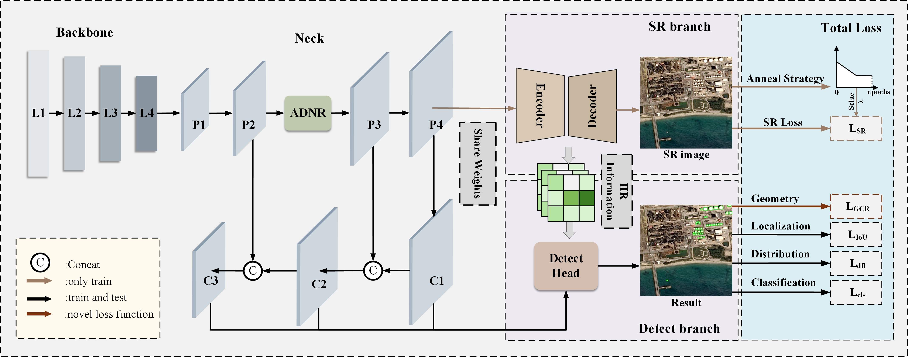

# GNSRNet: A Geometric Guided Noise Reduction Super-Resolution Network for Remote Sensing Tiny Object Detection


<p align='center'>
  
</p>


## Abstract

Tiny objects in remote sensing typically face the challenges of being submerged in complex backgrounds, limited feature representation, and high sensitivity to prediction errors due to their small size and diverse shape. These challenges make tiny object detection a significant difficulty, and traditional object detection methods often yield poor performance. To tackle irrelevant information interference, insufficient feature representation, and neglect of the objects' geometric characteristics, a Geometric Guided Noise Reduction Super-Resolution Network is proposed. First, an adaptive dynamic noise reduction module is introduced to fundamentally mitigate spatial misalignment in feature fusion by effectively suppressing the noise arising from the upsampling process. Second, a coupled-training and decoupled-detection Dual-Stream Progressive Super-Resolution detection head is incorporated. The head reduces the receptive field to precisely align with tiny object dimensions and employs a weight-sharing mechanism to implicitly learn super-resolution features. Furthermore, a novel progressive loss annealing strategy is utilized to reduce the dependency of the super-resolution branch. Third, a geometric characteristic regression metric is proposed. This metric comprehensively considers the location prediction and the shape similarity between the prediction and ground truth boxes. By enhancing the quality of prediction boxes, which improve the accuracy of prediction. Extensive experiments were produced on the remote sensing tiny object dataset AI-TOD v1, AI-TOD v2, USOD, and VisDrone, compared with other state-of-the-art (SOTA) methods, GNSRNet demonstrates superior performance on these benchmarks. Specifically, it reaches an AP of 31.4 on AI-TOD v1, 30.4 on AI-TOD v2, 37.4 on USOD, and 30.3 on the VisDrone, which achieves SOTA performance.


## Requirements

CUDA Version: 11.3

torch: 1.11.0

Python: 3.8.10

## Dataset

The dataset directory should look like this:

```bash
datasets
├── Houston
│   ├── Houston13.mat
│   ├── Houston13_7gt.mat
│   ├── Houston18.mat
│   └── Houston18_7gt.mat
└── Pavia
    ├── paviaC.mat
    └── paviaC_7gt.mat
    ├── paviaU.mat
    └── paviaU_7gt.mat

```

## Usage

1.You can download [Houston &amp; Pavia](https://github.com/YuxiangZhang-BIT/Data-CSHSI) dataset here, and the CLIP pre-training weight [ViT-B-32.pt](https://openaipublic.azureedge.net/clip/models/40d365715913c9da98579312b702a82c18be219cc2a73407c4526f58eba950af/ViT-B-32.pt) here.

2.You can change the `source_name` and `target_name` in train.py to set different transfer tasks.

3.Run python train_queue.py.

## Note

- The variable names of data and gt in .mat file are set as `ori_data` and `map`.
- For Pavia dataset and Houston dataset, args.re_ratio is set to 1 and 5, respectively
